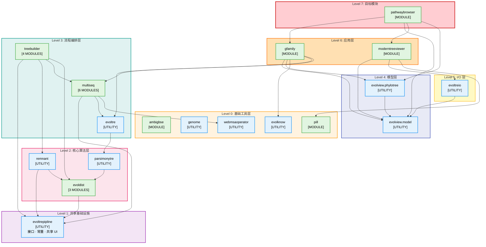

# 模块依赖 DAG

## 概览

本文描述 `module.evolview.pathwaybrowser` 模块生态当前的有向无环依赖图。

**当前事实**

- **包总数：** 18
- **包含模块的包：** 8
- **工具包：** 10
- **模块总数：** 18
- **依赖层数：** 7
- **循环依赖：** 0

下图反映的是当前源码布局。`treebuilder` 已纳入当前依赖面。

---

## 依赖规则

当前架构遵循以下规则：

1. 依赖只允许向下流动。
2. 低层包不依赖应用层包。
3. `evoltrepipline` 保持为共享基础设施，而不是业务逻辑容器。
4. `evolview.phylotree` 与 `gfamily` 保持解耦。
5. `evoltreio` 依赖 `evolview.model`，而不是浏览器专用 UI 包。

图中 `A --> B` 表示 `A` 依赖 `B`。

---

## DAG 图

---

## 分层摘要

| 层级 | 角色 | 包 |
|------|------|----|
| 0 | 基础工具 | `ambigbse`、`genome`、`evolknow`、`pill`、`webmsaoperator` |
| 1 | 共享基础设施 | `evoltrepipline` |
| 2 | 核心算法 | `evoldist`、`remnant`、`parsimonytre` |
| 3 | 流程编排 | `evoltre`、`multiseq`、`treebuilder` |
| 4 | 模型层 | `evolview.model`、`evolview.phylotree` |
| 5 | I/O 层 | `evoltreio` |
| 6 | 应用层 | `evolview.moderntreeviewer`、`evolview.gfamily` |
| 7 | 目标模块 | `evolview.pathwaybrowser` |

---

## 关键演进结果

当前 DAG 已经稳定体现出这些结果：

- `evoltrepipline` 不再依赖业务算法包。
- `evolview.phylotree` 通过共享树可视化抽象与 `gfamily` 解耦。
- `evoltreio` 以 `evolview.model` 为树结构读写基础。
- 共享的 alignment-view 数据模型已经放到 `evoltrepipline.alignment`。
- `pathwaybrowser` 保持在依赖面的最顶层，只消费下层能力。
